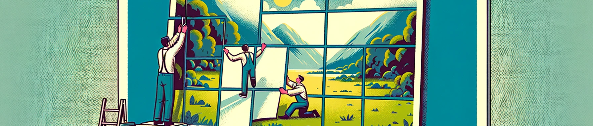

# Poster Generator

Poster Generator is a Python-based command-line tool that allows you to create large, multi-page posters from standard-sized paper formats like A4 or letter. It's designed to split a single image across multiple pages, which can be easily printed on personal printers, and then assembled into a large poster.



## Features

- **Customizable Poster Size**: Generate posters for personal-size printers by creating a multi-page PDF.
- **Adjustable Grid Width**: Choose the number of pages for the width of your poster. The height is automatically adjusted.
- **Automatic Image Scaling**: Scales your image to fit the specified dimensions.
- **Cut Lines for Easy Assembly**: Adds cut lines to facilitate easy assembly of the poster.
- **Support for Various Paper Formats**: Compatible with most paper sizes.
- **Orientation Options**: Choose between portrait or landscape orientation.
- **Wide Image Format Support**: Works with most image formats, including SVG (requires additional setup on ARM Macs for CairoSVG).

## Dependencies

- `reportlab`: For PDF generation.
- `PIL` (Pillow): For image processing.
- `argparse`: For parsing command-line arguments.
- `svglib`: Required if working with SVG files.

## Installation

```bash
pip install reportlab Pillow argparse
# For SVG support
pip install svglib
```

## Usage

Generate a poster from an image that can be printed on common printers. The script creates a PDF that upsizes the image and splits it across several pages.

### Positional Arguments
`image_file`: Path to the input image file.  
`grid_width`: Grid width -- the number of pages in the width of your poster.

### Optional Arguments
- `-h`, `--help`: Show the help message and exit.  
- `-output [OUTPUT]`: Name for the output PDF file. If not specified, the output file name is derived from the input file name by appending `-poster.pdf` at the end (default behavior).  
- `-format [FORMAT]`: Paper format (default: A4).  
- `-orientation [ORIENTATION]`: Page orientation, portrait or landscape (default: portrait).  
- `-margin [MARGIN]`: Margin in pixels (default: 70).  

## Examples
```bash
python poster_generator.py myimage.jpg 2
```
This command will generate a poster from myimage.jpg.  
It will create a PDF named `myimage-poster.pdf` in the same directory as myimage.jpg.  
This poster will have a width equivalent to `2` pages in format `A4` and in `portrait` orientation.  
The height of the poster will be automatically adjusted to maintain the image's proportions while filling the poster's width.  
A `margin of 70` pixels will be included to facilitate assembling the pages. 

```bash
python poster_generator.py myimage.jpg 4 -output /tmp/myposter.pdf -format A5 -orientation landscape -margin 50
```
This command will generate a poster from myimage.jpg.  
It will create a PDF named `myposter.pdf` in the directory `/tmp`   
This poster will have a width equivalent to `4` pages in format `A5` and in `landscape` orientation.  
The height of the poster will be automatically adjusted to maintain the image's proportions while filling the poster's width.  
A `margin of 50` pixels will be included to facilitate assembling the pages.

## License

This project is licensed under GNU GPL. Feel free to use, modify, and distribute as per the license terms.

## Contributing

Contributions are welcome! If you'd like to contribute, please fork the repository and use a feature branch. Pull requests are warmly welcome.

## Support and Feedback

If you encounter any issues or have feedback, please open an issue on the GitHub repository.

Happy Poster Making!
